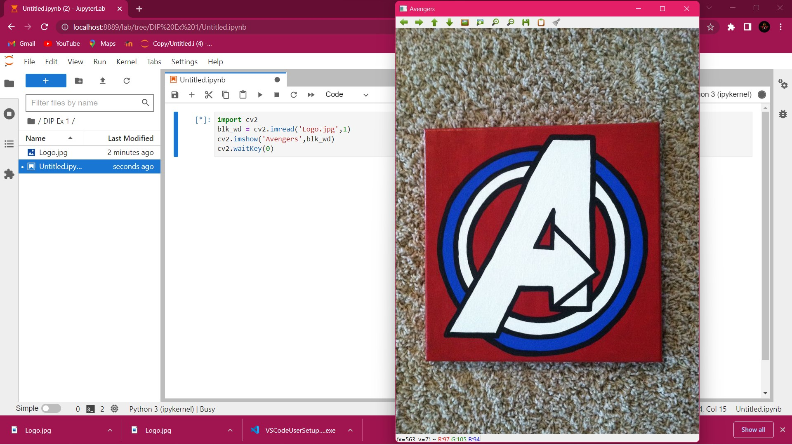
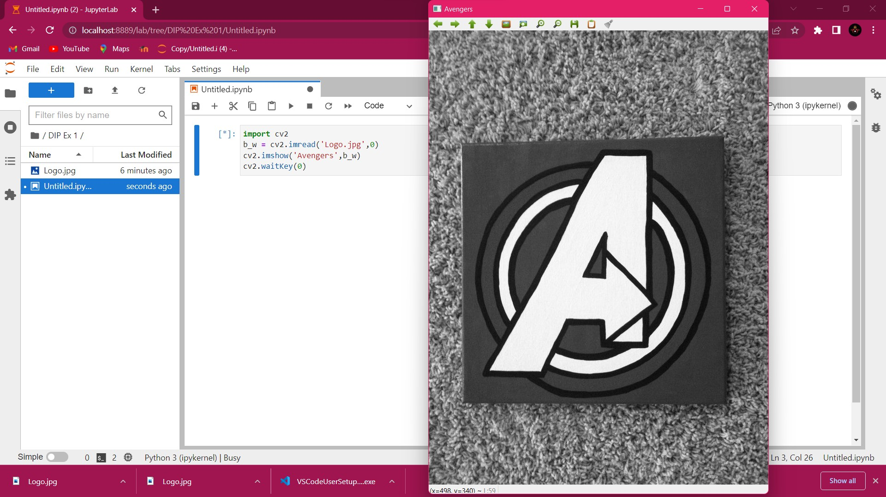
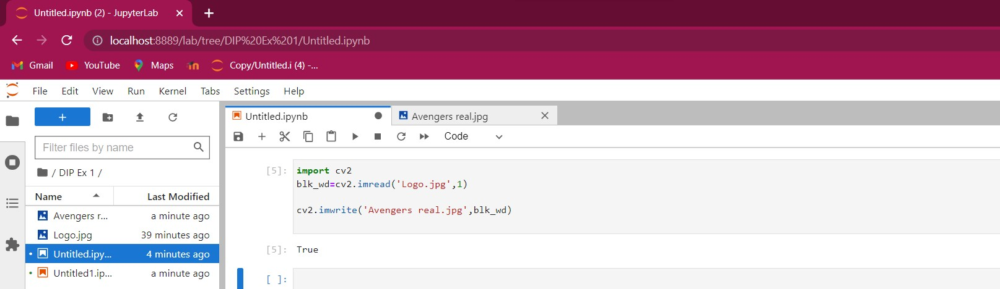
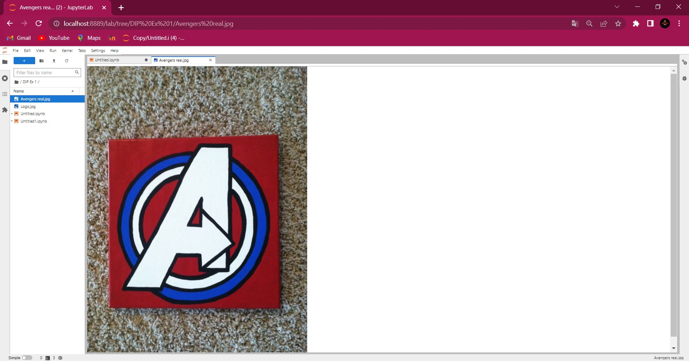
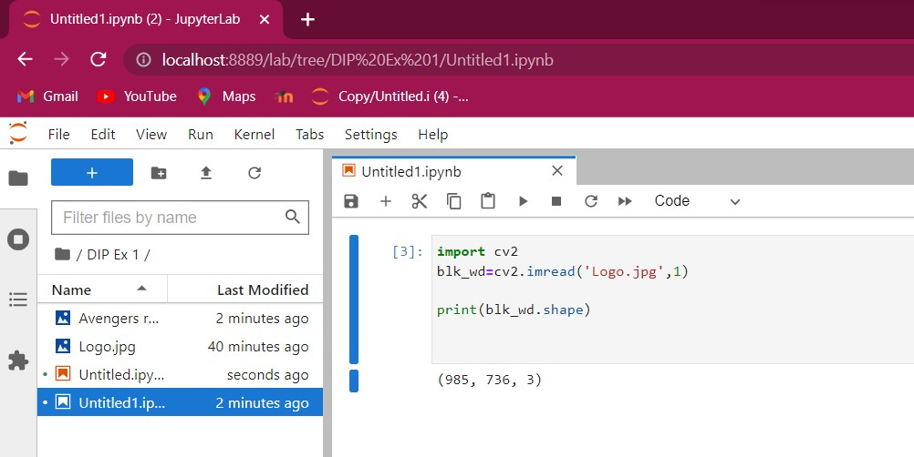
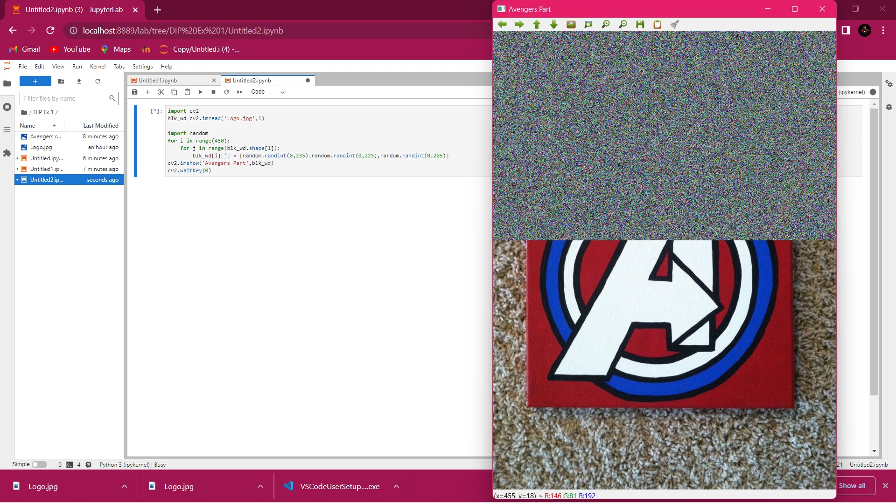
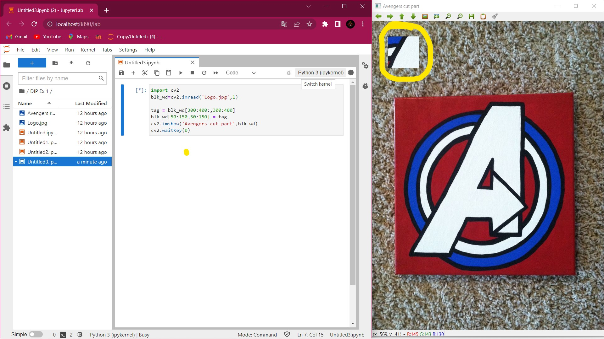

# READ AND WRITE AN IMAGE
## AIM
To write a python program using OpenCV to do the following image manipulations.
i) Read, display, and write an image.
ii) Access the rows and columns in an image.
iii) Cut and paste a small portion of the image.

## Software Required:
Anaconda - Python 3.7
## Algorithm:
### Step1:
Choose an image and save it as a filename.jpg
### Step2:
Use imread(filename, flags) to read the file.
### Step3:
Use imshow(window_name, image) to display the image.
### Step4:
Use imwrite(filename, image) to write the image.
### Step5:
End the program and close the output image windows.

## Program:

```
#Developed By: Yuvadarshini S
#Register Number: 212221230126

#To Read,display the image

#Color image:

import cv2
blk_wd=cv2.imread('Logo.jpg',1)
cv2.imshow('Avengers',blk_wd)
cv2.waitKey(0)

#Grayscale image: 

import cv2
b_w=cv2.imread('Logo.jpg',0)
cv2.imshow('Avengers',b_w)
cv2.waitKey(0)

# To write the image

import cv2
blk_wd=cv2.imread('Logo.jpg',1)

cv2.imwrite('Avengers real.jpg',blk_wd)


# Find the shape of the Image

import cv2
blk_wd=cv2.imread('Logo.jpg',1)

print(blk_wd.shape)

# To access rows and columns

import cv2
blk_wd=cv2.imread('Logo.jpg',1)

import random
for i in range(450):
    for j in range(blk_wd.shape[1]):
        blk_wd[i][j] = [random.randint(0,235),random.randint(0,225),random.randint(0,205)]
cv2.imshow('Avengers Part',blk_wd)
cv2.waitKey(0)

# To cut and paste portion of image

import cv2
blk_wd=cv2.imread('Logo.jpg',1)

tag = blk_wd[300:400:,300:400]
blk_wd[50:150,50:150] = tag
cv2.imshow('Avengers cut part',blk_wd)
cv2.waitKey(0)

```

## Output:

### i) Read and display the image


Color Image



Grayscale Image



### ii)Write the image




### iii)Shape of the Image



### iv)Access rows and columns



### v)Cut and paste portion of image



## Result:
Thus the images are read, displayed, and written successfully using the python program.


